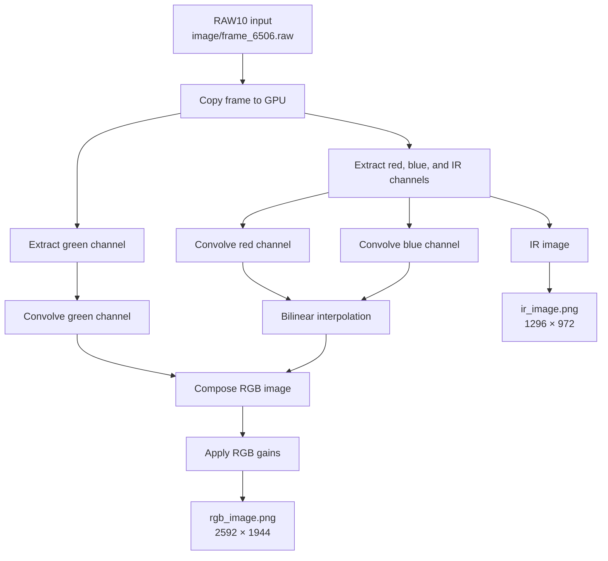

# CUDA Image Processing

A Linux C++17/CUDA project that processes a bundled RAW10 camera frame on the GPU. The `main` executable extracts IR and colour channels, interpolates and combines them into an RGB image, applies per-channel gains, and writes PNG outputs.

## Features

- CUDA RAW10 processing for the bundled 2592 × 1944 frame
- GPU kernels for green, red/blue, and IR extraction; convolution; bilinear interpolation; RGB composition; and gain adjustment
- PNG output through OpenCV

## RAW10 pixel format

The input is a 2592 × 1944 RAW10 frame stored at `image/frame_6506.raw`. Each group of four pixels occupies five bytes; the application reads the packed rows with a 16-byte-aligned stride. The current frame layout uses a colour-plus-IR mosaic: green samples are extracted at full resolution, while red, blue, and IR samples are extracted at half resolution before RGB reconstruction.

Pixel layout (G = green, R = red, B = blue, Ir = infrared):
```
R   G    B    G   R    G    B    G
G   Ir   G    Ir  G    Ir   G    Ir
B   G    R    G   B    G    R    G
G   Ir   G    Ir  G    Ir   G    Ir
R   G    B    G   R    G    B    G
```
MIPI CSI-2 RAW10 packing:
```
Byte 0:  G0[9:2] | Byte 1: G1[9:2] | Byte 2: G2[9:2] | Byte 3: G3[9:2] | Byte 4: G0[1:0] G1[1:0] G2[1:0] G3[1:0]
```

## Processing flow



## Requirements

- Docker Desktop or Docker Engine
- NVIDIA GPU container support
- `image/frame_6506.raw`

## Docker

Build and run from the repository root. Docker and NVIDIA GPU container support
must be installed. The local `image/` folder supplies `frame_6506.raw` and
receives `ir_image.png` and `rgb_image.png`.

### Dockerfile configuration

The root [`Dockerfile`](Dockerfile) uses
`nvidia/cuda:13.3.0-devel-ubuntu24.04`, installs CMake and OpenCV, copies the
source and input image, builds the program with CMake, and installs it:

```dockerfile
ARG CUDA_ARCHITECTURES=120

COPY CMakeLists.txt ./
COPY source ./source
COPY image ./image

RUN cmake -S . -B build \
        -DCMAKE_BUILD_TYPE=Release \
        -DCMAKE_CUDA_ARCHITECTURES="${CUDA_ARCHITECTURES}" \
        -DBUILD_CAMERA_CONTROL=OFF \
    && cmake --build build --parallel \
    && cmake --install build
```

The installed program runs automatically when the container starts:

```dockerfile
ENTRYPOINT ["/usr/local/bin/main"]
```

Architecture `120` targets Blackwell GPUs such as the RTX50 Generation.

### Compose configuration

Before running, check [`compose.yaml`](compose.yaml):

```yaml
services:
  image-processing:
    build:
      context: .
      args:
        CUDA_ARCHITECTURES: "120"
    image: cuda-image-processing
    gpus: all
    volumes:
      - type: bind
        source: ./image
        target: /app/image
```

Change `CUDA_ARCHITECTURES` for a different GPU and change `source` if the host
image folder is not `./image`.

### Build and run

The same command works in Command Prompt, PowerShell, and Linux Bash:

```text
docker compose up --build
```

## Project layout

```text
source/
  main.cpp                    Executable entry point and PNG output
  image_processing/           CUDA RAW10-to-IR/RGB pipeline
  camera_control/             OpenCV camera wrapper (Later expansion to live webcam input)
image/frame_6506.raw          Sample RAW10 input frame
```
