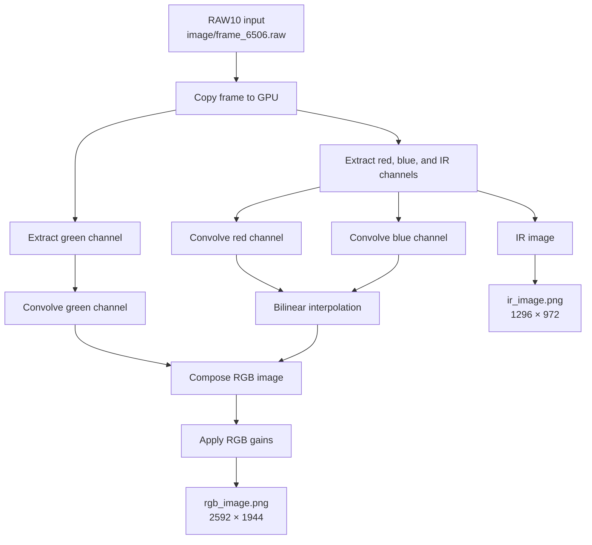

# CUDA Image Processing

A Windows- and Linux-compatible C++17/CUDA project that processes a bundled RAW10 camera frame on the GPU. The `main` executable extracts IR and colour channels, interpolates and combines them into an RGB image, applies per-channel gains, and writes PNG outputs.

## Features

- CUDA RAW10 processing for the bundled 2592 × 1944 frame
- GPU kernels for green, red/blue, and IR extraction; convolution; bilinear interpolation; RGB composition; and gain adjustment
- PNG output through Windows Imaging Component (WIC) on Windows and OpenCV on Linux

## RAW10 pixel format

The input is a 2592 × 1944 RAW10 frame stored at `image/frame_6506.raw`. Each group of four pixels occupies five bytes; the application reads the packed rows with a 16-byte-aligned stride. The current frame layout uses a colour-plus-IR mosaic: green samples are extracted at full resolution, while red, blue, and IR samples are extracted at half resolution before RGB reconstruction.

Pixel layout (G = green, R = red, B = blue, Ir = infrared):
```
R   G    B    G   R    G    B    G
G   Ir   G    Ir  G    Ir   G    Ir
B   G    R    G   B    G    R    G
G   Ir   G    Ir  G    Ir   G    Ir
R   G    B    G   R    G    B    G
```
MIPI CSI-2 RAW10 packing:
```
Byte 0:  G0[9:2] | Byte 1: G1[9:2] | Byte 2: G2[9:2] | Byte 3: G3[9:2] | Byte 4: G0[1:0] G1[1:0] G2[1:0] G3[1:0]
```

## Processing flow



## Requirements

- Windows or Linux
- CMake 3.18 or later
- A C++17-capable compiler (Visual Studio/MSVC on Windows, GCC or Clang on Linux)
- CUDA Toolkit and a CUDA-capable NVIDIA GPU
- [vcpkg](https://github.com/microsoft/vcpkg) with the manifest dependencies installed

The project uses the vcpkg toolchain automatically when the `VCPKG_ROOT` environment variable is set. `vcpkg.json` installs the OpenCV 4 PNG support used by Linux builds.

By default, CUDA targets are compiled for Blackwell (`sm_120`). Blackwell GeForce GPUs, including the RTX 5070, require CUDA Toolkit 12.8 or later; CUDA 13.3 is supported. For another supported GPU architecture, disable that option and specify your architecture during configuration.

## Build

On Windows, in a Developer PowerShell for Visual Studio, configure and build the Debug executable:

```powershell
$env:VCPKG_ROOT = "C:\path\to\vcpkg"
cmake -S . -B build
cmake --build build --config Debug
```

On Linux, use CUDA Toolkit 12.8 or later for Blackwell GPUs. The following selects the CUDA Toolkit installed at `/usr/local/cuda` (CUDA 13.3 in the current development environment), uses vcpkg, and rebuilds CMake's compiler cache:

```bash
export VCPKG_ROOT=/path/to/vcpkg
export CUDA_HOME=/usr/local/cuda
export CUDACXX="$CUDA_HOME/bin/nvcc"
export PATH="$CUDA_HOME/bin:$PATH"

cmake --fresh -S . -B build \
  -DCMAKE_BUILD_TYPE=Debug \
  -DCMAKE_CUDA_COMPILER:FILEPATH="$CUDACXX" \
  -DCMAKE_TOOLCHAIN_FILE="$VCPKG_ROOT/scripts/buildsystems/vcpkg.cmake"
cmake --build build --parallel
```

CMake detects the target platform automatically. It links Windows Imaging Component and Shell APIs on Windows, and OpenCV's PNG encoder on Linux. CMake caches its CUDA compiler per build directory; use `--fresh` whenever changing CUDA versions. Confirm the selected compiler with `rg 'CMAKE_CUDA_COMPILER' build/CMakeCache.txt`.

For a non-Blackwell GPU on Linux, use a CUDA architecture appropriate for your hardware:

```bash
cmake --fresh -S . -B build \
  -DCMAKE_CUDA_COMPILER:FILEPATH="$CUDACXX" \
  -DCMAKE_TOOLCHAIN_FILE="$VCPKG_ROOT/scripts/buildsystems/vcpkg.cmake" \
  -DENABLE_BLACKWELL_ARCH=OFF \
  -DCMAKE_CUDA_ARCHITECTURES=<architecture>
cmake --build build --parallel
```

For example, replace `<architecture>` with `86` for an Ampere RTX 30-series GPU. An RTX 5070 uses architecture `120`; keep the default `ENABLE_BLACKWELL_ARCH=ON` and ensure `nvcc --version` reports CUDA 12.8 or later. On Windows, add the same two architecture definitions to the first CMake configuration command. If CMake cannot locate MSVC, run `vcvars64.bat` from the Visual Studio Build Tools installation before configuring.

## Run

Run the program from the repository root so it can locate `image/frame_6506.raw`:

```powershell
.\build\source\Debug\main.exe
```

On Linux (with a single-config generator):

```bash
./build/source/main
```

Optional arguments set red, green, and blue gains:

```powershell
.\build\source\Debug\main.exe <redGain> <greenGain> <blueGain>
```

For example:

```powershell
.\build\source\Debug\main.exe 1.1 1.0 0.9
```

The program prints GPU information and per-kernel timings, then creates:

- `image/ir_image.png` — 1296 × 972 grayscale IR image
- `image/rgb_image.png` — 2592 × 1944 RGB image

On Windows, it also asks the operating system to open both files with their default associated application.

## Project layout

```text
source/
  main.cpp                    Executable entry point and PNG output
  image_processing/           CUDA RAW10-to-IR/RGB pipeline
  camera_control/             OpenCV camera wrapper (Later expansion to live webcam input)
image/frame_6506.raw          Sample RAW10 input frame
```
