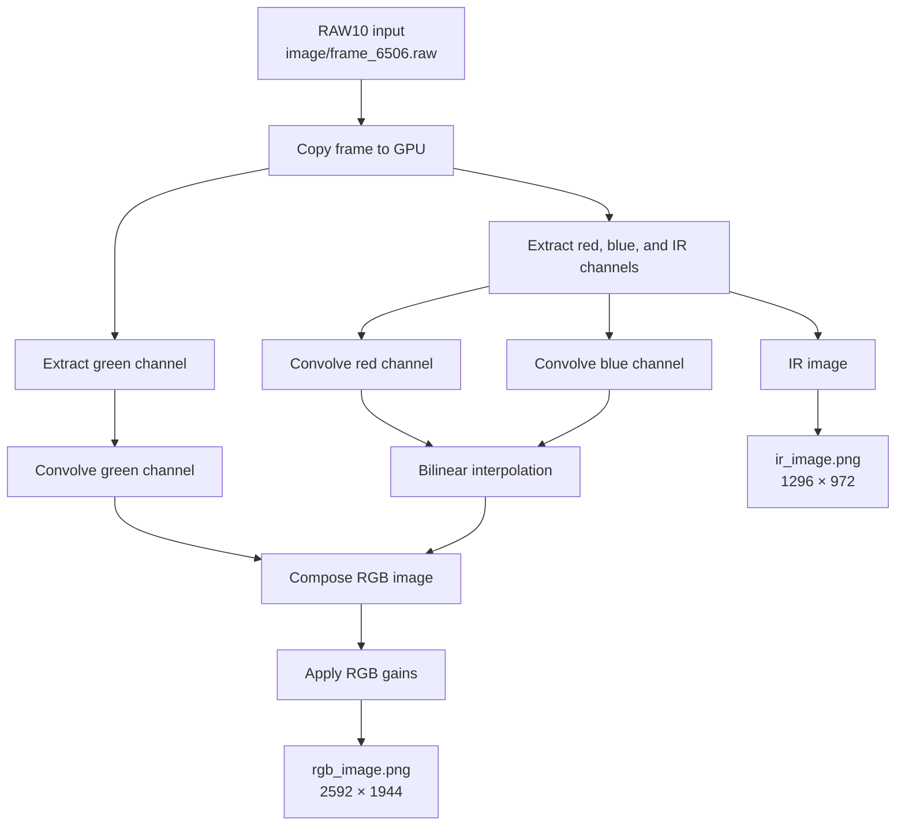

# CUDA Image Processing

A Linux C++17/CUDA project that processes a bundled RAW10 camera frame on the GPU. The `main` executable extracts IR and colour channels, interpolates and combines them into an RGB image, applies per-channel gains, and writes PNG outputs.

## Features

- CUDA RAW10 processing for the bundled 2592 × 1944 frame
- GPU kernels for green, red/blue, and IR extraction; convolution; bilinear interpolation; RGB composition; and gain adjustment
- PNG output through OpenCV

## RAW10 pixel format

The input is a 2592 × 1944 RAW10 frame stored at `image/frame_6506.raw`. Each group of four pixels occupies five bytes; the application reads the packed rows with a 16-byte-aligned stride. The current frame layout uses a colour-plus-IR mosaic: green samples are extracted at full resolution, while red, blue, and IR samples are extracted at half resolution before RGB reconstruction.

Pixel layout (G = green, R = red, B = blue, Ir = infrared):
```
R   G    B    G   R    G    B    G
G   Ir   G    Ir  G    Ir   G    Ir
B   G    R    G   B    G    R    G
G   Ir   G    Ir  G    Ir   G    Ir
R   G    B    G   R    G    B    G
```
MIPI CSI-2 RAW10 packing:
```
Byte 0:  G0[9:2] | Byte 1: G1[9:2] | Byte 2: G2[9:2] | Byte 3: G3[9:2] | Byte 4: G0[1:0] G1[1:0] G2[1:0] G3[1:0]
```

## Processing flow


```mermaid
flowchart TD
    Input["RAW10 input<br/>image/frame_6506.raw"] --> Upload["Copy frame to GPU"]
    Upload --> Green["Extract green channel"]
    Upload --> RedBlueIR["Extract red, blue, and IR channels"]
    Green --> GreenFilter["Convolve green channel"]
    RedBlueIR --> RedFilter["Convolve red channel"]
    RedBlueIR --> BlueFilter["Convolve blue channel"]
    RedBlueIR --> IR["IR image"]
    RedFilter --> Interpolate["Bilinear interpolation"]
    BlueFilter --> Interpolate
    GreenFilter --> Compose["Compose RGB image"]
    Interpolate --> Compose
    Compose --> Gain["Apply RGB gains"]
    Gain --> RGB["rgb_image.png<br/>2592 × 1944"]
    IR --> IROutput["ir_image.png<br/>1296 × 972"]
```

## Requirements

- Docker Desktop or Docker Engine
- NVIDIA GPU container support
- `image/frame_6506.raw`

## Run the program

Run all commands from the repository root. The supported workflow uses Docker so
the CUDA compiler, runtime, and OpenCV version remain consistent.

The default Compose configuration targets CUDA architecture `120`, used by
Blackwell GPUs such as the RTX 50 series. For another GPU, update
`CUDA_ARCHITECTURES` in [`compose.yaml`](compose.yaml) before building.

### 1. Build the image

```text
docker compose build
```

Rebuild after changing C++, CUDA, CMake, or Docker configuration.

### 2. Verify GPU access

```text
docker compose run --rm --entrypoint nvidia-smi image-processing
```

This command must show the host NVIDIA GPU. If it fails, configure NVIDIA GPU
container support before running the application.

### 3. Process the sample frame

Ensure `image/frame_6506.raw` exists, then run:

```text
docker compose run --rm app
```

The program processes the bundled 2592 x 1944 RAW10 frame and writes these files
to the host `image/` directory:

- `image/ir_image.png`
- `image/rgb_image.png`

The default red, green, and blue gains are all `1.0`. To provide custom gains:

```text
docker compose run --rm app 1.2 1.0 0.9
```

The positional values are `rGain gGain bGain`.

## Docker configuration

### Dockerfile configuration

The root [`Dockerfile`](Dockerfile) uses
`nvidia/cuda:13.3.0-devel-ubuntu24.04`, installs CMake and OpenCV, copies the
source and input image, builds the program with CMake, and installs it:

```dockerfile
ARG CUDA_ARCHITECTURES=120

COPY CMakeLists.txt ./
COPY source ./source
COPY image ./image

RUN cmake -S . -B build \
        -DCMAKE_BUILD_TYPE=Release \
        -DCMAKE_CUDA_ARCHITECTURES="${CUDA_ARCHITECTURES}" \
        -DBUILD_CAMERA_CONTROL=OFF \
    && cmake --build build --parallel \
    && cmake --install build
```

The installed program is the image's default command:

```dockerfile
CMD ["/usr/local/bin/main"]
```

Architecture `120` targets Blackwell GPUs such as the RTX50 Generation.

### Compose configuration

Before running, check [`compose.yaml`](compose.yaml):

```yaml
services:
  image-processing:
    build:
      context: .
      args:
        CUDA_ARCHITECTURES: "120"
    image: cuda-image-processing
    gpus: all
    volumes:
      - type: bind
        source: ./image
        target: /app/image
      - type: bind
        source: ./reports
        target: /app/reports
```

Change `CUDA_ARCHITECTURES` for a different GPU and change `source` if the host
image folder is not `./image`.

## Project layout

```text
source/
  main.cpp                    Executable entry point and PNG output
  image_processing/           CUDA RAW10-to-IR/RGB pipeline
  camera_control/             OpenCV camera wrapper (Later expansion to live webcam input)
image/frame_6506.raw          Sample RAW10 input frame
```

## Benchmarking

The repository includes a repeatable CUDA benchmark, Nsight Systems importer,
optional Nsight Compute importer, and SQLite comparison database.

Build the image before benchmarking, and rebuild it after every code change.
Keep the GPU, input, build configuration, warmup count, and iteration count
constant when comparing results.

### Short commands

The application, benchmark, profiler, and comparison tool are named Compose
services. They all use the same image, so build it once and use these commands:

| Task | Command |
|---|---|
| Build or rebuild | `docker compose build` |
| Run the application | `docker compose run --rm app` |
| Run the standalone benchmark | `docker compose run --rm benchmark` |
| Capture an NSYS profile and store it in SQLite | `docker compose run --rm profile` |
| Compare stored runs | `docker compose run --rm compare` |

There are no separate normal, benchmark, or comparison images. A single image
contains all executables and tools, which prevents build settings from drifting
between variants.

### Quick benchmark

Run the standalone benchmark without creating profiler reports or a database:

```text
docker compose run --rm benchmark
```

The command prints one `BENCHMARK_JSON=...` record containing mean, median, p95,
minimum, maximum, standard deviation, throughput, GPU information, and output
hashes. The run is marked nondeterministic if its output hashes change between
measured iterations.

Available options:

```text
cuda_benchmark [--warmup N] [--iterations N] [--input PATH]
               [--r-gain N] [--g-gain N] [--b-gain N]
```

Override the default five warmups and thirty measured iterations by appending
options to the short command:

```text
docker compose run --rm benchmark --warmup 10 --iterations 100
```

### Capture a profiled benchmark

The full capture runs the application once without profiling for trustworthy
end-to-end timing, then again under Nsight Systems. It imports both results into
SQLite:

```text
docker compose run --rm profile
```

The host `reports/` directory receives:

- `cuda-benchmarks.sqlite`
- A timestamped report such as `capture-20260830T123456Z.nsys-rep`

The capture label and report filename use the current UTC timestamp, so repeated
runs do not overwrite earlier reports. After a code change, rebuild the image
and capture another run with the same benchmark arguments:

```text
docker compose build
docker compose run --rm profile
```

### Compare captured runs

```text
docker compose run --rm compare
```

The comparison shows application latency and throughput alongside aggregate
kernel, memory-copy, and bandwidth measurements. Confirm that output hashes
match before accepting a performance improvement.

See [`docs/CUDA_BENCHMARKING.md`](docs/CUDA_BENCHMARKING.md) for detailed SQL
queries, Nsight Compute collection, fair-comparison rules, and possible future
improvements.
