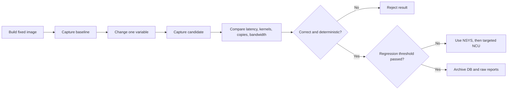

# CUDA benchmarking and comparison database

## Current features

The repository provides three levels of CUDA performance analysis:

1. The standalone benchmark measures complete image-processing latency,
   throughput, variability, and output determinism.
2. Nsight Systems records how GPU time is distributed across kernels,
   transfers, launches, and waits.
3. Nsight Compute collects detailed metrics for selected kernels, including
   compute, memory, occupancy, and latency limits.

The standalone benchmark is the authoritative application timer. Nsight
Systems provides whole-workload analysis, while Nsight Compute is used only for
targeted kernel investigation because its instrumentation substantially changes
execution.

## Container strategy

### Current implementation

The repository uses one single-stage Dockerfile for application execution and
benchmarking. `docker compose build` creates the `cuda-image-processing` image
from the CUDA development base and builds Release versions of both executables:

- `/usr/local/bin/main`
- `/usr/local/bin/cuda_benchmark`

The same image also contains Python, `cuda_bench.py`, Nsight Systems, and Nsight
Compute. Docker Compose gives the container GPU access and bind-mounts the
`image/` and `reports/` directories so inputs and profiling artifacts remain on
the host.

This single image ensures that the application and profiler use the same
source, compiler, CUDA version, architecture, and optimized binaries. It is
intended for the repository's current learning and local benchmarking workflow;
it is not a minimized production runtime image.

## Industry benchmark loop



Typical tool frequency:

| Tool | When used | Purpose |
|---|---|---|
| Unprofiled benchmark | Every performance experiment | Trustworthy latency, throughput, variance |
| NSYS | Baseline, candidate, regression investigation | Whole CPU/GPU timeline and operation totals |
| NCU | Only selected hot kernels | Explain compute, memory, occupancy, and stall limits |
| SQLite | Every run | History, metadata, queries, before/after comparison |

## Metrics stored

### Application metrics

- Mean, median, p95, minimum, maximum, and standard deviation in milliseconds
- Throughput in frames per second
- Warmup and measured iteration counts
- Input and output byte counts
- IR and RGB FNV-1a hashes
- Whether hashes remained deterministic across measured iterations

Application duration includes device allocation, input upload, every kernel,
output download, synchronization, and device deallocation. It excludes RAW file
loading, PNG encoding, and PNG file writing.

### Nsight Systems metrics

- Per-kernel total, average, median, minimum, maximum, and standard deviation
- Kernel invocation count and share of total kernel time
- CUDA API time and call counts
- API, queue, kernel, and launch-to-completion phases
- H2D and D2H copy duration, byte count, and effective bandwidth
- Total kernel time, copy time, API time, and kernel/copy shares

Effective transfer bandwidth is calculated as:

```text
GB/s = bytes / duration_ns
```

This works because one byte per nanosecond equals one decimal GB/s.

### Optional Nsight Compute metrics

The importer accepts every numeric metric in an NCU raw report. Useful groups:

- GPU Speed of Light: compute and memory utilization versus hardware peak
- DRAM, L2, and L1/TEX throughput and cache hit rates
- Requested versus actual global-memory traffic and load/store efficiency
- Achieved and theoretical occupancy
- Registers per thread, shared memory per block, and launch waves
- Eligible/active warps and scheduler issue rate
- Warp stall reasons and branch efficiency
- Instructions, cycles, and roofline arithmetic intensity

NCU metrics are GPU-architecture-dependent. Compare them only on compatible
GPUs, tool versions, inputs, launch configurations, and build settings.

## Build

```powershell
docker compose build
```

The image contains:

- `/usr/local/bin/cuda_benchmark`
- `/app/tools/cuda_bench.py`
- `nsys` and `ncu` from the CUDA development image

The existing GitHub Actions workflow also verifies that the Docker image builds
successfully on pushes and pull requests to `master`.

### Short Compose commands

The named services use the same image and provide a short interface for the
common workflow:

| Task | Command |
|---|---|
| Run the application | `docker compose run --rm app` |
| Run the standalone benchmark | `docker compose run --rm benchmark` |
| Capture NSYS and store the run in SQLite | `docker compose run --rm profile` |
| Compare stored runs | `docker compose run --rm compare` |

The `profile` service generates a UTC timestamp for both the run label and NSYS
report filename. Explicit `cuda_bench.py` options remain available for custom
labels, report paths, commands, and iteration counts.

## Preflight

Start Docker Desktop, then verify GPU and tools:

```powershell
docker compose run --rm --entrypoint nvidia-smi image-processing

docker compose run --rm --entrypoint bash image-processing `
  -lc "nsys --version && ncu --version && /usr/local/bin/cuda_benchmark --help"
```

Before recording a baseline, close unrelated GPU workloads. Keep GPU power
policy, clocks, thermals, driver, input, and container limits stable.

## Capture a benchmark

From the repository root:

```text
docker compose run --rm profile
```

The capture command performs two runs:

1. Unprofiled run for application latency and throughput
2. NSYS-profiled run for kernels, transfers, APIs, and queue time

Generated files appear in host `reports/` through the Compose bind mount.

By default, the run receives a label and filename like:

```text
capture-20260830T123456Z
capture-20260830T123456Z.nsys-rep
```

Use the explicit `cuda_bench.py capture` interface when a meaningful label,
fixed report path, commit, notes, or custom benchmark command is required.

### Capture baseline and candidate

Baseline:

```text
docker compose run --rm profile
```

Make one code or configuration change, rebuild, then capture candidate:

```text
docker compose build
docker compose run --rm profile
```

The short profile service uses five warmups and thirty measured iterations for
both captures. Keep all benchmark arguments identical except the single
variable being tested.

## Import an existing NSYS report

```powershell
docker compose run --rm --entrypoint python3 image-processing `
  /app/tools/cuda_bench.py import-nsys `
  --db /app/reports/cuda-benchmarks.sqlite `
  --report /app/reports/image-processing.nsys-rep `
  --label old-baseline
```

Profile-only imports contain kernel/API/copy metrics but no unprofiled
application latency or output hashes.

## Capture and import NCU metrics

First find the hottest kernel with NSYS. Then profile only that kernel:

```powershell
docker compose run --rm --cap-add SYS_ADMIN --entrypoint ncu image-processing `
  --set full `
  --kernel-name-base function `
  --kernel-name regex:combine_rgb_kernel `
  --launch-count 1 `
  --force-overwrite `
  --export /app/reports/combine-rgb `
  /usr/local/bin/cuda_benchmark --warmup 0 --iterations 1
```

Attach the resulting metrics to the matching benchmark run ID:

```powershell
docker compose run --rm --entrypoint python3 image-processing `
  /app/tools/cuda_bench.py import-ncu `
  --db /app/reports/cuda-benchmarks.sqlite `
  --run-id 1 `
  --report /app/reports/combine-rgb.ncu-rep
```

If NCU reports `ERR_NVGPUCTRPERM`, enable GPU performance counters on the host.
On Windows/WSL this setting is controlled through NVIDIA Control Panel.

## Compare runs

```text
docker compose run --rm compare
```

Example columns:

```text
ID  Label                 App median  FPS       Kernels   Copies    BW
1   baseline                 8.200 ms  120.000   0.340 ms  5.100 ms  4.100 GB/s
2   persistent-buffers       5.300 ms  186.000   0.335 ms  4.900 ms  4.260 GB/s
```

List run metadata:

```powershell
docker compose run --rm --entrypoint python3 image-processing `
  /app/tools/cuda_bench.py list `
  --db /app/reports/cuda-benchmarks.sqlite
```

### Retrieve detailed values

Open `reports/cuda-benchmarks.sqlite` using DB Browser for SQLite, DBeaver, the
`sqlite3` CLI, Python, or another SQLite client. Raw `.nsys-rep` and `.ncu-rep`
files remain available for their NVIDIA GUIs.

Find run IDs:

```sql
SELECT id, recorded_at, label, status, gpu_name, git_commit
FROM benchmark_runs
ORDER BY id DESC;
```

Application latency and throughput:

```sql
SELECT
    r.id,
    r.label,
    m.metric,
    m.aggregation,
    m.value,
    m.unit,
    m.sample_count
FROM measurements AS m
JOIN benchmark_runs AS r ON r.id = m.run_id
WHERE m.scope = 'application'
  AND m.metric IN ('duration', 'throughput')
ORDER BY r.id, m.metric, m.aggregation;
```

Compare kernel medians between baseline run `1` and candidate run `2`:

```sql
WITH baseline AS (
    SELECT subject, value
    FROM measurements
    WHERE run_id = 1
      AND source = 'nsys'
      AND scope = 'kernel'
      AND metric = 'duration'
      AND aggregation = 'median'
),
candidate AS (
    SELECT subject, value
    FROM measurements
    WHERE run_id = 2
      AND source = 'nsys'
      AND scope = 'kernel'
      AND metric = 'duration'
      AND aggregation = 'median'
)
SELECT
    baseline.subject AS kernel,
    baseline.value / 1000.0 AS baseline_us,
    candidate.value / 1000.0 AS candidate_us,
    100.0 * (candidate.value - baseline.value) / baseline.value AS delta_pct
FROM baseline
JOIN candidate USING (subject)
ORDER BY delta_pct DESC;
```

Positive `delta_pct` means slower. Negative means faster.

Compare transfer bandwidth:

```sql
SELECT
    r.label,
    m.subject AS transfer,
    m.value AS bandwidth_gbps
FROM measurements AS m
JOIN benchmark_runs AS r ON r.id = m.run_id
WHERE m.source = 'derived'
  AND m.scope = 'transfer'
  AND m.metric = 'effective_bandwidth'
ORDER BY m.subject, r.id;
```

Retrieve selected NCU indicators:

```sql
SELECT
    r.label,
    m.subject AS kernel,
    m.metric,
    m.value,
    m.unit
FROM measurements AS m
JOIN benchmark_runs AS r ON r.id = m.run_id
WHERE m.source = 'ncu'
  AND (
      m.metric LIKE '%Memory Throughput%' OR
      m.metric LIKE '%Compute%Throughput%' OR
      m.metric LIKE '%Achieved Occupancy%' OR
      m.metric LIKE '%DRAM Throughput%'
  )
ORDER BY r.id, m.subject, m.metric;
```

### Decide whether candidate is better

Check in this order:

1. `status` is complete and does not contain `nondeterministic`.
2. Output hashes match trusted baseline.
3. Application median improved.
4. p95 and standard deviation did not regress badly.
5. FPS improved consistently with latency.
6. Kernel or transfer metric explains the improvement.
7. Same result repeats in at least one new capture.

Suggested starting policy for this learning project:

| Signal | Initial rule |
|---|---|
| Correctness | Hashes must match; run must be deterministic |
| Median latency | Reject regression greater than 5% |
| p95 latency | Reject regression greater than 10% |
| Throughput | Investigate decrease greater than 5% |
| Variability | Investigate standard deviation greater than 5% of mean |

These are starting thresholds, not universal CUDA standards. Tighten them after
collecting enough stable history from the target deployment GPU.

## SQLite schema

`benchmark_runs` stores experimental context: label, timestamp, status, command,
commit, device, CUDA versions, report path, notes, and JSON metadata.

`measurements` stores extensible numeric observations:

```text
run_id, source, scope, subject, metric, value, unit, aggregation,
sample_count, metadata_json
```

Example query for kernel medians:

```sql
SELECT
    r.label,
    m.subject AS kernel,
    m.value / 1000.0 AS median_us
FROM measurements AS m
JOIN benchmark_runs AS r ON r.id = m.run_id
WHERE m.source = 'nsys'
  AND m.scope = 'kernel'
  AND m.metric = 'duration'
  AND m.aggregation = 'median'
ORDER BY m.subject, r.id;
```

## Fair comparison rules

Keep constant:

- GPU model and power/clock policy
- Driver, CUDA, NSYS, and NCU versions
- Release build and CUDA architecture
- Input data, dimensions, and gain values
- Warmup and measured iteration counts
- Other GPU/CPU workload and container limits

Prefer median for typical latency, p95 for tail latency, and standard deviation
for stability. Use at least 30 measured iterations; use more for noisy systems.
Change one variable per experiment and record the change in the label or notes.

Hashes test repeatability, not algorithmic correctness. A trusted CPU reference
or golden image is still required. The current convolution kernel reads and
writes the same device buffer concurrently; treat its output and performance as
provisional until it uses separate input/output buffers.

## Possible improvements

### Multi-stage runtime and benchmark images

When a production image is needed, evolve the Dockerfile into a multi-stage
build with named runtime and benchmark targets:

```text
build stage
├── runtime target    -> executable + runtime libraries only
└── benchmark target  -> same executable + benchmark script + NSYS/NCU
```

This would preserve a shared build while allowing the runtime image to exclude
compilers and profiling tools. The benchmark image could retain Python, NSYS,
NCU, symbols, and `-lineinfo` without affecting deployment size or attack
surface.

```dockerfile
FROM nvidia/cuda:<version>-devel-ubuntu24.04 AS build
# Install compiler dependencies, copy source, build Release binaries.

FROM nvidia/cuda:<version>-runtime-ubuntu24.04 AS runtime
# Install only required OpenCV runtime libraries.
COPY --from=build /usr/local/bin/main /usr/local/bin/main
CMD ["/usr/local/bin/main"]

FROM build AS benchmark
RUN apt-get update && apt-get install --yes python3
COPY tools /app/tools
CMD ["/usr/local/bin/cuda_benchmark"]
```

Pin the same CUDA version and architecture in every stage. Record the resolved
image digest as run metadata when exact reproducibility matters.

A separate `Dockerfile.benchmark` may be more appropriate if the runtime and
benchmark images need different operating systems, are owned and released by
different teams, or must be separated by security policy.

### Automated performance CI

Add a second CI workflow on a dedicated Linux NVIDIA runner to capture
benchmarks and compare them with an approved baseline. The job could run
manually, nightly, or when a pull request receives a performance label.

```yaml
runs-on: [self-hosted, linux, x64, gpu, rtx5070]
```

The workflow should use stable clocks and controlled thermals, then upload:

- `cuda-benchmarks.sqlite`
- Unprofiled benchmark JSON or stdout
- `.nsys-rep`
- Targeted `.ncu-rep`, when collected
- Image digest and build metadata

Binary profiler reports and the growing SQLite database should remain CI
artifacts or object-storage objects rather than being committed to Git.

### Shared benchmark storage

SQLite is appropriate for one developer or one benchmark runner. A future team
dashboard with many runners could preserve the measurement model while sending
records to PostgreSQL, ClickHouse, BigQuery, or another centrally managed
analytics store. Raw NSYS and NCU reports would remain in artifact or object
storage.

### Additional metrics

- Energy per frame and average GPU power through NVML sampling
- GPU temperature and clock throttling reasons
- Host CPU utilization and resident memory
- Peak device allocation and memory-pool reuse
- Multi-stream overlap percentage
- End-to-end latency under concurrent requests
- Correctness error versus CPU reference, such as max error, RMSE, or PSNR
- Performance per watt and performance per dollar for deployment decisions

## References

- [Docker multi-stage build documentation](https://docs.docker.com/build/building/multi-stage/)
- [Docker build best practices](https://docs.docker.com/build/building/best-practices/)
- [CUDA C++ Best Practices Guide](https://docs.nvidia.com/cuda/cuda-c-best-practices-guide/)
- [Nsight Systems analysis guide](https://docs.nvidia.com/nsight-systems/AnalysisGuide/)
- [Nsight Compute profiling guide](https://docs.nvidia.com/nsight-compute/ProfilingGuide/)
- [GitHub self-hosted runner labels](https://docs.github.com/en/actions/how-tos/manage-runners/self-hosted-runners/use-in-a-workflow)
